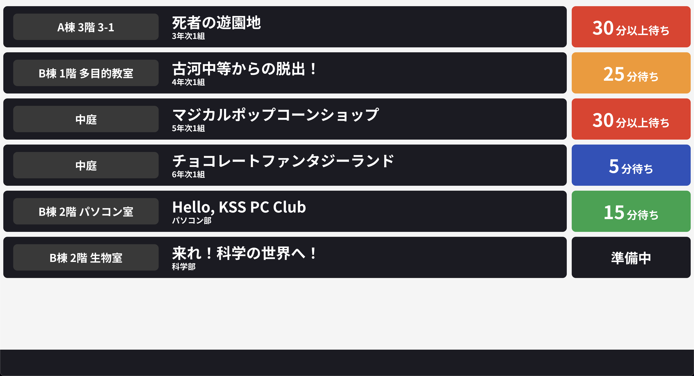
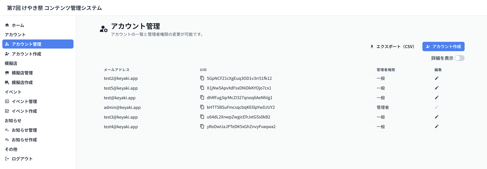
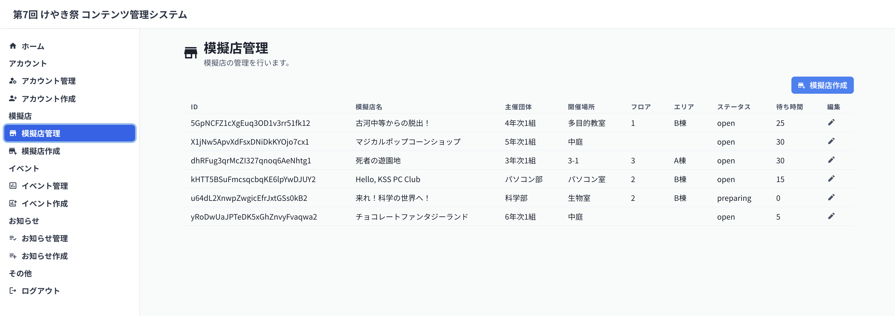
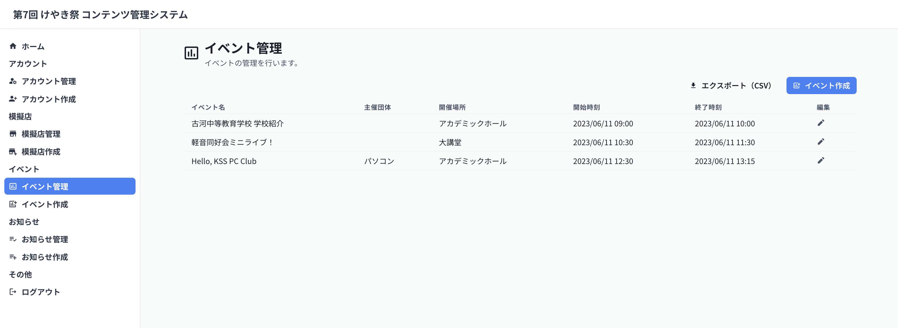
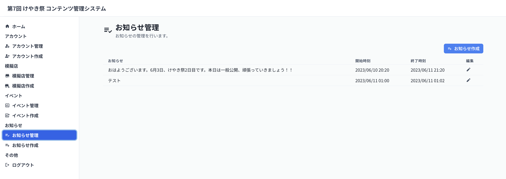
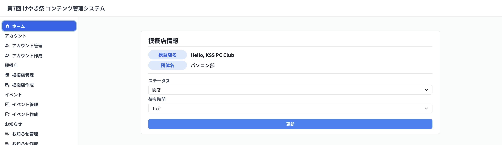

# Festival Monitor

文化祭で各模擬店の混雑状況（待ち時間）やタイムテーブルを管理し、電子掲示板上で表示するための Web アプリです。

## 開発方法

1. 本リポジトリを Clone
2. `Node.js`と`yarn`をインストール
3. 依存関係をインストール(`yarn install`)
4. Husky の準備をする(`yarn postinstall`)
5. 環境変数を記述
6. ローカルサーバをたてる(`yarn dev`)
7. `localhost:3000`にアクセス

## 環境変数

### Firebase について

本ソフトウェアは Firebase（Firestore と Authentication）に依存しています。
運用にあたっては各自 Firebase のプロジェクトを立ち上げ、環境変数に必要となる値をセットしてください。
なお、Firebase Authentication のログインプロバイダとしては`メール/パスワード`のみサポートしています。

### NextAuth について

[こちら](https://next-auth.js.org/configuration/options)を参考に、`NEXTAUTH_URL`と`SECRET`の値をセットしてください。
ただし、本ソフトウェアを Vercel にデプロイする場合は、[こちら](https://zenn.dev/msy/articles/fe4e7d44e5d095)を参考に追加の設定を行ってください。

## 初期設定

本ソフトウェアの利用にあたっては、管理者権限を持ったユーザが 1 名以上必要ですが、管理者権限の設定を Firebase の画面上から行うことができないため、ローカルで設定をする必要があります。
以下の手順で設定を行ってください。

1. Firebase Authentication の画面上でメールアドレスとパスワードを設定し、ユーザを追加する
2. ローカルサーバを立ち上げ、ログイン(`/login`)画面にアクセスする
3. 1 で作成したメールアドレスとパスワードを使用してログインする
4. `api/admin/accounts/localhost`にアクセスする
5. `{message: Success}`と表示され流ことを確認する
6. `/logout`にアクセスし、ログアウトする

再度ログインすると、閲覧に管理者権限が必要となるページ（`/admin`以下）が表示できるようになっているはずです。

## 運用

### ディスプレイ

各模擬店の混雑状況（待ち時間）、タイムテーブル、お知らせを表示します。
`/monitor`にアクセスすることで表示でき、ログインは必要ありません。デフォルトの画面切り替え時間は 12 秒、各画面の表示数は最大 7 段、情報更新間隔は 5 分です。

### アカウント管理

本ソフトウェアにログインするためのアカウントの管理を行います。
アカウントの新規作成・削除と管理者権限の付与を行うことが可能で、管理者権限を持ったアカウントは、「アカウント管理」「模擬店管理」「イベント管理」「お知らせ管理」を行うことができるようになります。

### 模擬店管理

模擬店の新規作成・削除・情報の更新を行います。ここで作成している模擬店情報がディスプレイ上に表示されるようになります。
模擬店の新規作成の際に必要となる ID には、アカウント管理画面で取得できる各アカウントの UID を使用します。
各アカウントでログインすると、自分のアカウント ID に紐付けられた模擬店の情報（ステータスと待ち時間）を操作できるようになります。（雰囲気で感じ取ってください。いい表現があったら教えてください）

### イベント管理

タイムテーブル画面に表示するイベントの作成・削除・情報の更新を行います。

### お知らせ管理

ディスプレイ下段に表示されるお知らせの作成・削除・更新を行います。
「開始時刻」〜「終了時刻」の間、ディスプレイにお知らせを表示します。（厳密には、ディスプレイの「開始時刻」以降、最初の情報更新時刻から「終了時刻」以降、最初の情報更新時刻までの間）

### ホーム

模擬店のステータス（準備中・開店・中断中・閉店）と混雑状況（待ち時間）の設定を行います。

## 変数

`src/libs/constants.ts`でいくつかの変数を設定することができます。
ファイルのコメントを参考に変数を設定してください。

todo: Firebase の初期設定、Vercel へのデプロイ方法、実運用の際の例（アカウント作成・各模擬店へのログイン情報/PC/マニュアルの配布・ディスプレイの表示）、トラブルシューティング

todo: 各模擬店の操作マニュアルの制作

todo: 運用方法をより詳細に記述する
